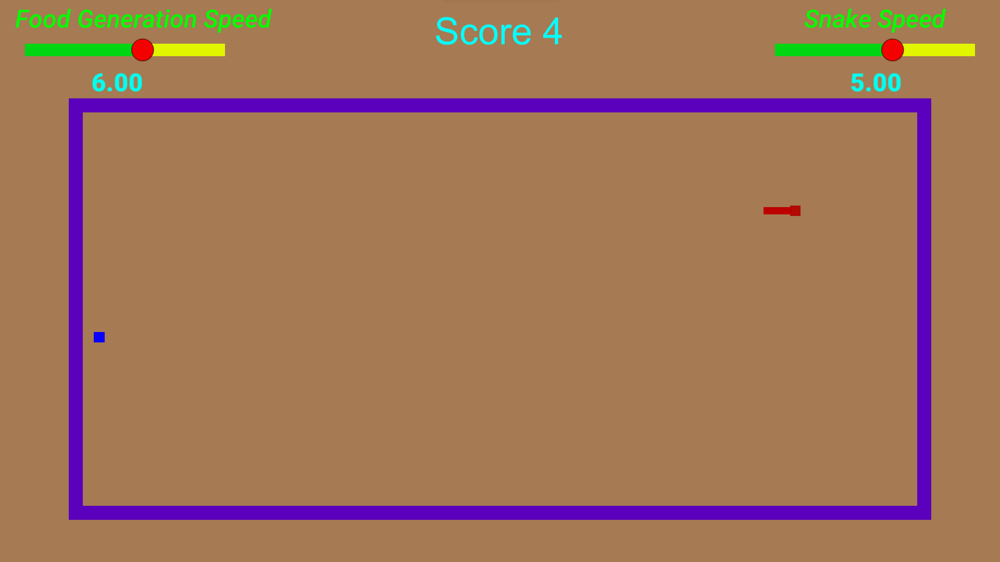
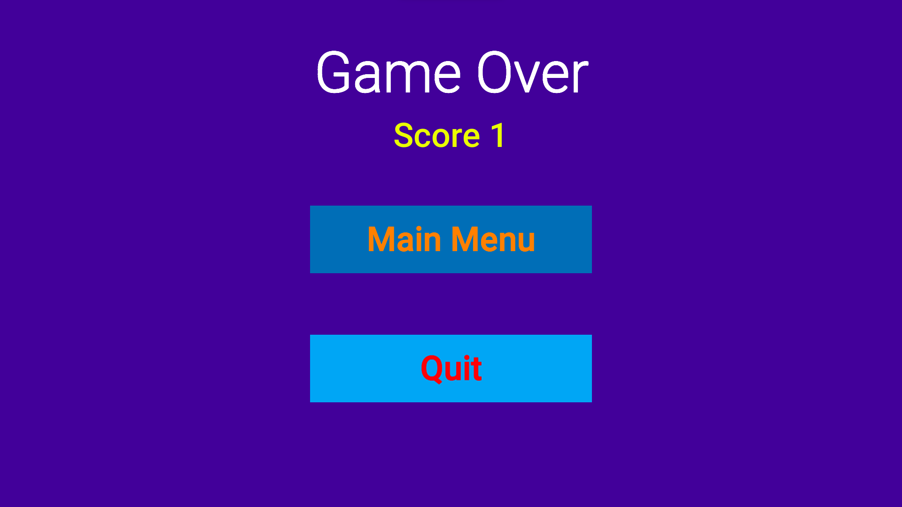

<h1 align="Center"> Snake Game </h1>

<h5 align="center"> Project Assignment 1 - Computer Game Development and Animation, <a href="https://nitw.ac.in/">NITW</a> (Winter 2021) </h5>

> Note: This is a sample/reference project — only the C# scripts are versioned here, not the full Unity project. It is not actively deployed.

<!-- ABOUT THE PROJECT -->
<h2 id="about-the-project"> :pencil: About The Project</h2>

 
  For those not familiar with the Snake game: the snake (a moving square, led by its head) moves around an open field bounded by a border and tries to eat as many food pellets (the small dots) as possible, while avoiding running into its own body (the tail). The game is all about how high a score you can reach — it can keep going for hours, and you can even adjust the speed of food generation and the speed of the snake.

<!-- OVERVIEW -->
<h2 id="overview"> :cloud: Overview</h2>

 
  In this project, the snake moves inside the bordered area and has to eat the food that appears around it. I implemented the movement logic using keyboard keys, along with the logic that keeps track of the score and grows the snake's size.

<!-- PROJECT FILES DESCRIPTION -->
<h2 id="language-and-tools-used"> 💻 Language and Tools Used</h2>

<ul>
  <li><b>C#</b> - For the code and libraries.</li>
  <li><b>Visual Studio Code</b> - Text editor for writing the C# scripts.</li>
  <li><b>Unity Engine</b> - Runtime environment that hosts and runs the scripts.</li>
</ul>

<!-- PROJECT FILES DESCRIPTION -->
<h2 id="project-files-description"> :floppy_disk: Project Files Description</h2>

<ul>
  <li><b>Scripts/SpawnFood.cs</b> - Controls how, where, and how fast food is generated.</li>
  <li><b>Scripts/MainMenuScript.cs</b> - Contains the Main Menu UI design and button alignment.</li>
  <li><b>Scripts/ScoreScript.cs</b> - Increments the score every time food is eaten.</li>
  <li><b>Scripts/SoundManager.cs</b> - Handles all sound effects, from the welcome screen to eating food to game over.</li>
  <li><b>Scripts/Snake.cs</b> - Binds all the scripts together and handles the snake's movement and growth rate.</li>
  <li><b>Scripts/GameOverScript.cs</b> - Contains the Game Over screen UI design and score bar.</li>
</ul>

 
 <h2 id="how-to-run-game"> ⏯️ How to Run the Game</h2>
 <ul>
  <li><b>STEP 1</b> - Download the playable build from <a href="https://github.com/Sagargupta16/Snake-Game__UnityEngine/releases/latest">Releases</a> (<b>SnakeGame.zip</b>). The source code is in the <b>Scripts</b> folder of this repository.</li>
  <li><b>STEP 2</b> - Extract <b>SnakeGame.zip</b> to get the playable folder with the game content.</li>
  <li><b>STEP 3</b> - Open the extracted folder, then double-click <b>Snake Game Self.exe</b> to play.</li>
  <li><b>STEP 4</b> - Enjoy the game!</li>
</ul>

